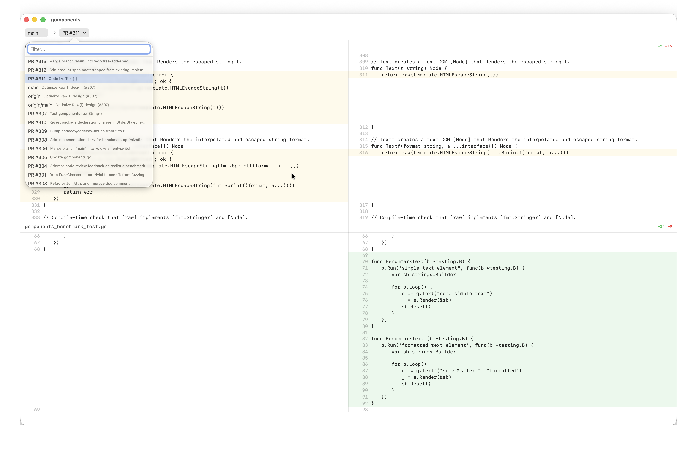

# WhatsChanged

A read-only macOS app for viewing side-by-side code diffs across git branches, worktrees, remotes, and GitHub PRs.

Built for developers who use AI coding agents that create branches and worktrees autonomously, and need a quick way to see what changed where.

Made with ✨sparkles✨ by [maragu](https://www.maragu.dev/): independent software consulting for cloud-native Go apps & AI engineering.

[Contact me at markus@maragu.dk](mailto:markus@maragu.dk) for consulting work, or perhaps an invoice to support this project?



## Features

- Side-by-side diff view with diff coloring and line numbers
- All local branches, remote branches, worktrees, and GitHub PR refs in one list, sorted by most recent commit
- Type-to-filter and arrow key navigation in ref pickers
- Keyboard-driven: Cmd+K/L to pick refs, Cmd+O to open a repo, Cmd+R to refresh

## Requirements

- macOS 26 (Tahoe)
- Swift 6.2+
- Git

## Usage

```shell
swift run WhatsChanged -- /path/to/repo
```

Or launch without arguments and use Cmd+O to pick a repository.

## Keyboard shortcuts

| Shortcut | Action |
|----------|--------|
| Cmd+O | Open repository |
| Cmd+R | Refresh refs |
| Cmd+K | Select base ref |
| Cmd+L | Select compare ref |

## Disclaimer

This app is 100% vibe-coded. No human has written a single line of Swift in this project.
